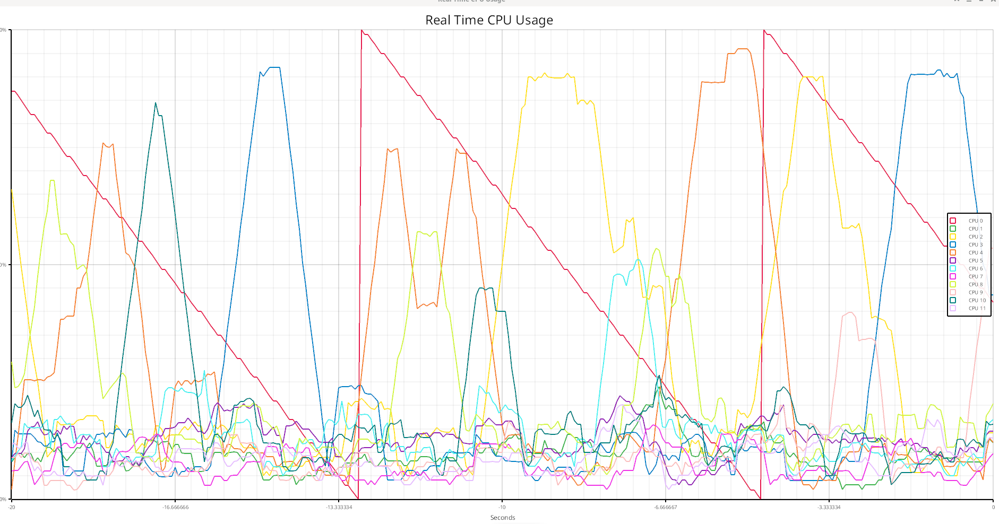

# realtime_plot

## doc

we use cpu plot fun

just cpu0 (red line ) get data from zeromq.


## compile and run

in 2 terminals 
* pub data
```sh
cargo run --example zmq_pub
```
* sub data and plot in realtime
```sh
cargo run --example plot
```

## reference

###  plotters-piston - The Piston Window backend for Plotters

This is a part of plotters project. For more details, please check the following links:
i
- For high-level intro of Plotters, see: [Plotters on crates.io](https://crates.io/crates/plotters)
- Check the main repo at [Plotters repo](https://github.com/38/plotters.git)
- For detailed documentation about this crate, check [plotters-backend on docs.rs](https://docs.rs/plotters-backend/)
- You can also visit Plotters [Homepage](https://plotters-rs.github.io)

### tmq
zeromq lib for rust .
## todo
### speed 
15 fps
### queue
zeromq
mqtt
socket
tcp 
http

## goal

plot your data lightly with rust.

🟢  🔴  🟡    ✏️